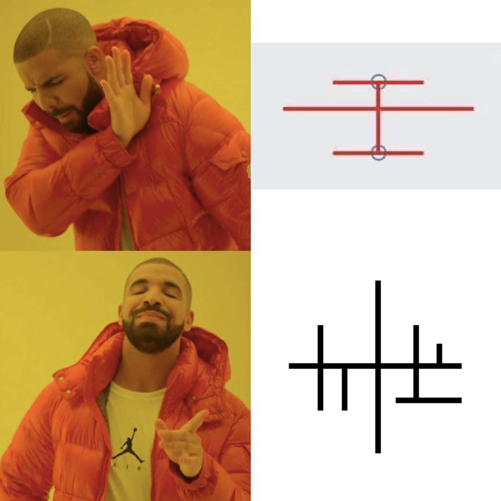

Markdown ช่วยให้การเขียนบทความเป็นเรื่องง่าย เราสามารถพิมพ์่เนื้อหาได้ไม่ต่างกับพิมพ์ไฟล์ text ทั่วไป แต่สิ่งที่พิเศษกว่านั้นก็คือ เราสามารถ format เนื้อหาง่าย ๆ ได้ด้วยสัญลักษณ์ไม่กี่อย่าง

-   นี่การสร้างรายการ
-   **นี่คือการทำให้เป็นตัวหนา**
-   _นี่คือการทำให้เป็นตัวเอียง_
-   [นี่คือการใส่ลิงก์ จำง่าย ๆ ว่า ข. มาก่อน ค. ทำให้่ต้องใช้วงเล็บแข็งก่อนวงเล็บโค้ง](https://example.com)

ถ้าจำ 4 แบบนี้ได้แล้ว ที่เหลือก็ไม่มีอะไรมาก

นอกจากนี้ ด้วยพลังแห่ง MDX เราสามารถใส่คลิปวิดีโอลงไปได้ดังเช่นวิดีโอด้านล่าง

<Video url="https://www.youtube.com/watch?v=dQw4w9WgXcQ" />

นอกจากนี้ เราก็ยังสามารถใส่ภาพลงไปได้

เห็นไหมว่า Markdowm ง่ายนิดเดียว!
